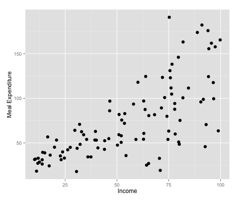

# Weighted least squares

Imagine that we want to fit a linear model, $y = X\beta + \epsilon$, where the error terms $\epsilon$ are assumed to be independent of $X$, but we do not believe the usual assumption that each of the error terms $\epsilon\_i$ are iid with $E(\epsilon | X) = 0$ and $Cov(\epsilon | X) = \sigma^2 I$. In particular, what if we have reason to believe that the common variance assumption is violated. That is, instead of each error term having the same variance (homoskedasticity), we allow the error terms to each have different variances (heteroskedasticity):

$$Cov(\epsilon | X) = \Sigma = \left[ \begin{array}{cccc} \sigma\_1^2 & 0 & \dots & 0\\\
 0 & \sigma\_{2}^2 & \dots & 0\\\
 \vdots & \vdots & \ddots & \vdots\\\
 0 & 0 & \dots & \sigma\_{n}^2\end{array} \right]$$
 
 
Note that the standard OLS assumption of homoskedasticity corresponds to the case where $\sigma\_1^2 = \sigma\_2^2 = \dots = \sigma\_n^2 = \sigma^2$. In the variance-covariance matrix above, we still assume *independent* errors, but we no longer assume *identically distributed* errors.

Heteroskedasticity is actually quite common, for example, suppose that we are interested in measuring household expenditure on meals as a function of household income. We might expect households of lower income to be more consistent in their food expenditure by always purchasing inexpensive food. Higher income households, on the other hand, will tend to be more variable in the amount they expend on their meals: on occasion, they will indulge in an extremely fancy and disturbingly expensive meal, while there will likely be other instances where they fall back on less expensive, yet more convenient meal options. Such an example of heteroskedasticity is demonstrated in the figure below, whereby we are observing household meal expenditure on a particular day versus income for 100 different households. We see that there is much less variability in the low-income households, whereas there is much more variability in the high-income households.

Given that for data which exhibits heteroskedasticity we are violating the iid assumption for the errors, can we still use the standard OLS procedure to estimate $\beta$? Technically, yes, we can use whatever estimator we want, however, whenever we violate model assumptions the estimates that we obtain are much less trustworthy. The question is, in what way are the estimates less trustworthy? Are they biased? Do they have incorrect variance? Are they even estimating the right thing? We will explore answers to these questions in the case of heteroskedaasticity below. Come back to these questions

-----

### Estimating $\beta$ in the presence of heteroskedasticity using weighted least squares

To estimate $\beta$ when we do not have constant variance across observations, we can use a procedure called weighted least squares (WLS). The motivation behind WLS is that we have less confidence in observations which are extremely variable, and so we would like to reduce their influence on the least squares estimator by down-weighting such observations. In the presence of heteroskedasticity, the standard OLS estimator would be dominated by these noisy observations. Our goal is to reduce the impact of the imbalance of noise in our data. The WLS estimator can thus be written as

$$\hat{\beta}\_{WLS} = \underset{\beta}{\text{argmin}} \sum\_{i=1}^n \left(\frac{y\_i - X\_i^T \beta}{\sigma\_i} \right)^2 = (y - X\beta)^T\Sigma^{-1}(y - X\beta)$$

where $\Sigma^{-1}$ is the inverse of the covariance matrix $\Sigma$, which, because $\Sigma$ is a diagonal matrix, the elements of the inverse are given by

$$\Sigma^{-1}\_{ij} = \begin{cases} \frac{1}{\sigma\_i^2} & \text{ if } i = j \\\ 0 &\text{otherwise} \end{cases}$$

Let's define $W = \Sigma^{-1}$. Note that the difference between $\hat{\beta}\_{WLS}$ and $\hat{\beta}\_{OLS}$ is the fact that we are dividing (weighting) by $\sigma\_i$ in the WLS estimator. It is not too hard to show that our WLS estimator $\hat{\beta}\_{WLS}$ satisfies

$$(X^TWX)\hat{\beta}\_{WLS} = X^TWy$$

(recall that our OLS estimator satisfied $(X^TX)\hat{\beta}\_{OLS} = X^Ty$). So if $X^TWX$ is invertible, our estimator becomes

$$\hat{\beta}\_{WLS} = (X^TWX)^{-1}X^TWy$$

This estimator is the maximum likelihood estimator of $\beta$ under hetersokedastic linear regression. Note that computation of this estimator requires that we know $W$, that is, we need to know the values of each of the $\sigma\_i$s which is pretty much never the case. In the next section, we will generalize this idea further, and discuss how to estimate $\beta$ even when we don't know the true values of the $\sigma\_i$.

------------------

# Generalized least squares

Next, we ask the question of what happens if we violate even more assumptions? For example, in the WLS situation above, we had violated the assumption that the error terms were identically distributed (by allowing for heteroskedasticity), but what happens if we also violate the assumption of independence? We can write this more general situation as

$$Cov(\epsilon | X) = G = \left[ \begin{array}{cccc} \sigma\_{11} &  \sigma\_{12} & \dots & \sigma\_{1n}\\\
 \sigma\_{21} & \sigma\_{22} & \dots & \sigma\_{2n}\\\
 \vdots & \vdots & \ddots & \vdots\\\
 \sigma\_{n1} & \sigma\_{n2} & \dots & \sigma\_{nn}\end{array} \right]$$

where $\sigma\_{ii} = \sigma\_i^2$ is the variance of observation $i$, and $\sigma\_{ij}$ is the covariance between observation $i$ and $j$. The WLS case discussed above corresponds to the special case where each of the $\sigma\_{ij}$ with $i \neq j$ are 0. To conduct least squares in this more general case, instead of weighting only by the diagonal elements $\sigma\_{ii}$, we weight by the entire covariance matrix, $G$:

$$\hat{\beta}\_{GLS} = \underset{\beta}{\text{argmin}} (y - X\beta)^T G^{-1}(y - X\beta)$$

Note that if $G$ is positive definite, then we can turn the above formulation into a standard OLS-type problem. Let's assume momentarily that $G$ is known (an unfortunately unrealistic assumption in real life), then since $G$ is positive definite, the SVD of $G$ tells us that there exists an orthogonal matrix $R$ and a diagonal matrix $D$ (whose entries are positive) such that $G = RDR^T$. We can thus calculate $G^{-1}$, $G^{\frac12}$ and $G^{-\frac12}$ as follows:
$$G^{-1} = RD^{-1}R^T, ~~~~~~G^{\frac12} = RD^{\frac12}R^T, ~~~~~~ G^{-\frac12} = RD^{-\frac12}R^T$$

This implies that we can write $G^{-1} = G^{-\frac12}G^{-\frac12}$ (note that it is not true of all matrices, $M$ that such a decomposition into "square-roots", $M^{\frac12}$, exists, but since $G$ was positive definite, we were able to use properties of orthogonal and diagonal matrices to explicitly show that such decompositions existed), and so

\begin{aligned}
(y - X\beta)^T G^{-1}(y - X\beta) &= (y - X\beta)^T G^{-\frac12} G^{-\frac12}(y - X\beta)\\\
& = \left(G^{-\frac12} y - G^{-\frac12}X \beta\right)^T\left(G^{-\frac12}y - G^{-\frac12}X\beta\right)
\end{aligned}

Thus, we can write

$$\hat{\beta}\_{GLS} = \underset{\beta}{\text{argmin}} (\tilde{y} - \tilde{X}\beta)^T (\tilde{y} - \tilde{X}\beta)$$

where $\tilde{y} = G^{-\frac12}y$ and $\tilde{X} = G^{-\frac12} X$. Notice that this is just a standard OLS problem on $\tilde{y}$ and $\tilde{X}$! Thus, if we knew $G$ and were thus able to calculate $\tilde{X}$ and $\tilde{y}$, then we could estimate $\beta$ by the usual OLS estimator: $$(\tilde{X}^T\tilde{X})^{-1}\tilde{X}^T\tilde{y}$$

In reality however, the true covariance matrix, $G$, is rarely known.

### Estimating $\hat{\beta}\_{WLS}$ when the covariance matrix, $G$, is unknown

In general, we can solve 

