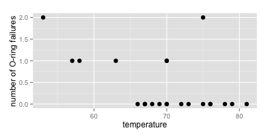

# The challenger O-ring failure

In January of 1986, the [NASA space shuttle orbiter *Challenger* mission](https://en.wikipedia.org/wiki/Space_Shuttle_Challenger_disaster) ended in disaster when the shuttle broke apart 73 seconds into its flight, killing all seven crew members on board. This incident is considered one of the worst space disasters of all time. The disintegration was caused by the failure of an O-ring seal which allowed pressurized burning gas to escape from within the solid rocket motor resulting in aerodynamic forces breaking up the shuttle.

These O-ring seals had been tested and shown to keep its their seal in temperatures as low as 40 degrees Fahrenheit, but on the morning of liftoff, the temperature was a mere 18 degrees Fahrenheit, a temperature described by Bob Ebeling from Thiokol as "no man's land" in terms of the range of temperatures considered to be safe for liftoff. The plot below shows the number of O-ring failures at each of 23 temperatures tested.

How could the analysts have predicted whether or not the O-ring would fail at 18 degrees Fahrenheit? Should we simply use our test observations to fit a linear model of the form: $\text{failure} = \beta\_0 + \beta\_1 \times \text{temperature} + \epsilon$? We could try, but it is unnecessary. The recommended approach, contrary to what you might be expecting, is to just *look at the data*! You don't need to fit fancy models or do fancy hypothesis tests to see that for all tests performed below 65 degrees, at least one of the O-rings failed. Surely if the analysts had actually *looked* at the data, they would not have recommended that the liftoff take place.

<!--
One approach might have been to use OLS to fit a linear model of the form

$$\text{failure} = \beta\_0 + \beta\_1 \times \text{temperature} + \epsilon$$

where we could estimate $\beta\_0$ and $\beta\_1$ using the 23 observations we already had. This is 
-->

