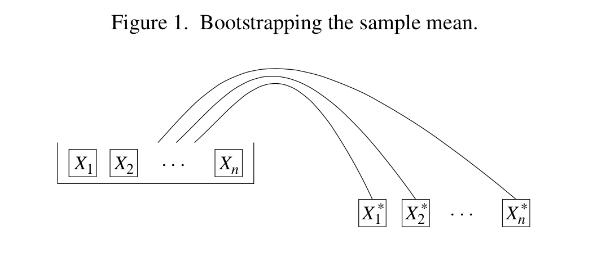

# The Bootstrap

The bootstrap is a method that uses sampling with replacement to generate empirical distributions in order to sidestep extreme distributional assumptions. In particular, it assumes that the notion of our observed sample being drawn from a population is analagous to the notion of a re-sample (with replacement) being drawn from our observed sample.

Making inference about our population (which, in most cases, we cannot observe) based on a sample drawn from the population is difficult to do without extreme theoretical assumptions. However, making inferences about our observed sample based on a re-sample (sample from our sample drawn with replacement) is easier because we can treat our observed sample as our "population". 

In the simplest case, suppose that $X\_1, ..., X\_n \overset{iid}{\sim} F$, for some unspecified distribution, $F$. Suppose that our first two moments are known, that is $EX\_1 = \mu$ and $EX\_q^2 = \sigma^2_X$. How could we calculate a confidence interval for $\mu$? If we had a large sample, we could use the central limit theorem (CLT) which says that asymptotically,

$$n (\bar{X} - \mu) \overset{d}{\rightarrow} N(0, \sigma_X^2)$$

and create a confidence interval of the form $(\bar{X} - 1.96 \frac{s}{\sqrt{n}}, \bar{X} + 1.96  \frac{s}{\sqrt{n}})$ where $1.96$ is the $97.5$th percentile of the Normal distirbution and $s$ is the estimated standard deviation of our population based on our sample. If our sample size is large enough, the central limit theorem tells us that this confidence interval for the mean is entirely reasonable.

However, what if we were interested in another statistic (recall that a statistic is defined to be any function of our data) for which we did not have such a nice asymptotic distributional result. Consider, for example, the the median, or some arbitrary model parameter estimate, $\hat{\beta}$? We could use the bootstrap method to estimate properties of our statistic based on empirical distributions (rather than by drawing potentially unrealistic distributional assumptions). 

### The nonparametric approach

For simplicity, we will demonstrate using the bootstrap to generate a confidence interval for the sample mean, $\overline{X}$ (pretending that we are ignorant to the central limit theorem). To begin, let's consider the data (the observed values of the $X\_i$'s) as a "little popuation", a term used in the *Statistical Models: Theory and Practice* by David A. Freedman. Next, we simulate $n$ drawns, made at random *with replacement* from this little population (so that some observations will likely be drawn more than once and others not at all) to get a **bootstrap sample** $X\_1^\*, ..., X\_n^\*$ of the same size as our original sample (see Figure 1, sourced from Freedman).

From a bootstrap sample, we can generate a bootstrap estimator, $\overline{X}^\* = \frac{1}{n} \sum\_{i=1}^n X\_i^\*$. However, given that we are interested in exploring the *distribution* of our original estimator, $\bar{X}$, a single draw, $\overline{X}^\*$, from our "population" of estimators is not hugely helpful. What we really want is to generate many $\bar{X}^\*$s to form an empirical distribution for $\overline{X}$, from which we can estimate its properties such as its variance. Thus, we typically generate $M$ (usually $M > 100$) bootstrap samples in order to obtain $M$ bootstrap estimates of $\overline{X}$:

$$X\_1^{\*(1)}, X\_2^{\*(1)}, ..., X\_n^{\*(1)}, \text{ generates the estimate } \overline{X}\_{(1)}^{\*}$$
$$X\_1^{\*(2)}, X\_2^{\*(2)}, ..., X\_n^{\*(2)} \text{ generates the estimate } \overline{X}\_{(2)}^{\*}$$
$$ \vdots $$
$$X\_1^{\*(M)}, X\_2^{\*(M)}, ..., X\_n^{\*(M)} \text{ generates the estimate } \overline{X}\_{(M)}^{\*}$$

The idea is that as $M$ gets large, the distribution of $\overline{X}^* - \overline{X}$ will be a good approximation for the distribution of $\overline{X} -\mu$. In particular, we should have that

$$P\left(\frac{ \overline{X} - \mu}{\sigma\_X} < t \right) \approx P\left(\frac{ \overline{X}^\* - \overline{X}}{\sigma\_X} < t \right)$$

by which we mean that the process of sampling from the population should be comparable to the process of taking a bootstrap sample from our original sample. Thus, since we can never observe $\mu$ but we do observe both $\overline{X}^\*$ and $\overline{X}$, we can use the probability on the RHS of the above expression to estimate the probability of interest on the LHS.

It is important to make the following distinction: since the bootstrap estimators, $\overline{X}^\*$, are generated by sampling from the original *sample* (rather than the population), whose mean is $\overline{X}$ (rather than $\mu$), it follows that $\overline{X}^\*$ is not a new estimator for the parameter $\mu$, but rather is something that we have generated to better understand the original estimator, $\overline{X}$. For instance, if we define 
$$ \overline{X}\_{ave}^\* = \frac{1}{M} \sum\_{k=1}^M \overline{X}\_{(k)}^\*$$ 

then we can estimate the true bias of our estimator, which is defined by $bias(\overline{X}) = E\left(\overline{X}\right) - \mu$, to be

$$bias(\overline{X}) \approx \overline{X} - \overline{X}\_{ave}^\*$$

and similarly the standard error of $\overline{X}$ to be

$$SE(\bar{X}) \approx \sqrt{\frac{1}{M} \sum\_{k=1}^M \left( \overline{X}\_{(k)}^\* - \overline{X}\_{ave}^\*\right)^2}$$

Note that the procedure described above is that of the *nonparametric bootstrap* for the sample mean in the sense that it makes absolutely no assumptions on the form of the original distribution, $F\_X$, of the data. 

#### The Nonparametric bootstrap in standard regression

There are many ways to apply bootstrapping to a regression problem. Suppose that we have the model

$$Y = X \beta + \epsilon$$

where $\epsilon\_1, ..., \epsilon\_n \sim N(0, \sigma^2)$ and that we are interested in obtaining the properties of the OLS estimator for $\hat{\beta}\_{OLS} = (X^TX)^{-1}X^TY$ but don't know any of the theoretical properties (let's ignore the fact that we know, for example, that the bias is $0$ and the covariance matrix is $\sigma^2(X^TX)^{-1}$). There are a number of ways that we could conceivably use the bootstrap procedure to estimate properties of $\hat{\beta}\_{OLS}$ such as its bias and variance.

The primary approach for to generating a bootstrap sample for $\hat{\beta}\_{OLS}$ involves generating a bootstrap sample of the responses, $y\_1^\*, ..., y\_n^\*$, so that we can define our bootstrap sample for $\hat{\beta}\_{OLS}$ to be

$$\hat{\beta}\_{OLS}^\* = (X^TX)^{-1}X^TY^*$$

where $Y^\* = [y\_1^\*, ..., y\_n^\*]^T$. The naive approach to doing this is to simply bootstrap the $y\_1, ..., y\_n$ by sampling with replacement as in the example above. However, recall that in a linear model such as $Y = X \beta  + \epsilon$, the randomness in the $Y$ comes from the iid random errors $\epsilon\_1, ..., \epsilon\_n$, and by construction, the $y\_i$'s are not drawn from the same distribution (e.g. each $y\_i$ has a different mean $E(y\_i) = x\_i^T\beta$), making directly bootstrapping the $y\_i$'s the entirely wrong thing to do. Thus, it makes more sense to bootstrap the errors $\epsilon\_1, ..., \epsilon\_n$, rather than the responses. There's just one problem... we never actually observe the $\epsilon\_i$'s.

One reasonable approach would be to approximate the distribution of the errors, $\epsilon\_i$, by the distribution of the corresponding model residuals, $e\_i = y\_i - x_i^T \hat{\beta}\_{OLS}$ (if the fitted model was actually the true model, then the residuals would be equal to the true errors). More specifically, we can define our "little population" to be the set of $n$ residuals, $e\_1, ..., e\_n$, and from this little population we will draw $n$ observations at random with replacement to get the bootstrap sample, $\epsilon\_1^\*, ..., \epsilon\_n^\*$, from which we can generate the bootstrap sample of the $y\_i$s to get 

$$y\_i^\* = x\_i^T\hat{\beta}\_{OLS} + \epsilon\_i^\*, ~~~~ i = 1, ..., n$$ 

Further we can obtain a bootstrap sample of our OLS estimator of $\hat{\beta}\_{OLS}$ by

$$\hat{\beta}^\* = (X^TX)^{-1}X^T Y^\*$$

and we can generate $M$ such bootstrap samples, $\hat{\beta}^\*\_{(k)}, k = 1, ..., M$.

Again, the idea is that if the sample size is large enough, then the empirical distribution given by $\hat{\beta}^\*\_{(k)} - \hat{\beta}\_{OLS}, k = 1, ..., M$ is a good approximation to the distribution of $\hat{\beta}\_{OLS} - \beta$. In particular, we have that

$$\sqrt{n} \left( \hat{\beta}\_{OLS} - \beta\right) \overset{d}{\approx} \sqrt{n}\left(\hat{\beta}^\* - \hat{\beta}\_{OLS}\right)$$

It is worth noting that when the true distirbution of $\epsilon$ has heavy tails, CLT and bootstrap approaches are less accurate.

### The parametric approach

In the nonparametric approach to the bootstrap that we have discussed so far, we have made no distributional assumptions on our data, and have simply used the sample as our bootstrap population. However, it is concievable that one might have an idea the form of the true distribution of the data although be ignorant of the true parameter values. For example, one might have binary data from which it might not seem unreasonable that the data, $X\_1, ..., X\_n$ comes from a $Bernoulli(p)$ distirbution, i.e. that each observation is either $0$ or $1$ with a fixed probability, but that the true value of the parameter, $p = P(X\_i = 1)$ is unknown. Certainly we can estimate $p$ by the proportion of $1$'s in our data (let's call this estimate $\hat{p}$). In this case, to generate a bootstrap sample, instead of sampling without replacement from the $X\_1, ..., X\_n$ (the nonparametric approach), we could draw samples from the estimated $Bernoulli(\hat{p})$ distribution. 

To place this notion in more general terms, suppose we knew that our data $X\_1, ..., X\_n \sim F(\theta)$, but that $\theta$ was unknown. We could use the overved data to generate an estimate, $\hat{\theta}$, of the distirbution parameter, and we could then draw our bootstrap samples from $F^\* = F(\hat{\theta})$ to obtain

$$X\_1^\* , ..., X\_n^\* \sim F\left(\hat{\theta}\right)$$

and repeat this $M$ times so that we could generate $M$ bootstraped versions of our statistic of interest, $T(X)$ (for example, we might have $T(X) = \bar{X}$):

$$X\_1^{\*(1)}, X\_2^{\*(1)}, ..., X\_n^{\*(1)} \sim F(\hat{\theta}), \text{ generates the estimate } T(X)\_{(1)}^{\*}$$
$$X\_1^{\*(2)}, X\_2^{\*(2)}, ..., X\_n^{\*(2)} \sim F(\hat{\theta})\text{ generates the estimate } T(X)\_{(2)}^{\*}$$
$$ \vdots $$
$$X\_1^{\*(M)}, X\_2^{\*(M)}, ..., X\_n^{\*(M)} \sim F(\hat{\theta})\text{ generates the estimate } T(X)\_{(M)}^{\*}$$

#### The parametric bootstrap in logistic regression

Unlike for standard linear regression, the maximum likelihood estimate (MLE) for logistic regression which is typically calcualted iteratively has less straightforward theoretical properties. Suppose that we have a dataset with binary responses, $y\_1, ..., y\_n \in \{0, 1\}$, and some predictor variables, $x\_{i1}, ..., x\_{ip}$, for each $y\_i$. Recall that the logistic regression model assumes that the $y\_i \sim Bernoulli(\pi\_i)$, where the probability, $\pi\_i$ was logistically related to the $x\_i^T$, i.e.

$$\pi\_i = \frac{e^{x\_i^T\beta}}{1 + e^{x\_i^T\beta}}$$

For this model, there is no closed form solution for the optimal $\beta$, so we typically calculate an approximation to the MLE, $\hat{\beta}\_{MLE}$, using iterative methods. How can we use the bootstrap to examine properties of our estimator, $\hat{\beta}\_{MLE}$? This is a slightly more complex problem than the standard linear regression problem above, but again, if we could draw bootstrap samples from the $y = (y\_1, ..., y\_n)$ directly, then we could use our $M$ bootstrapped samples $(y^\*\_{(k)}, X\_{(k)})\_{k = 1, ..., M}$ to obtain estimates, $\hat{\beta}^\*\_{(1)},..., \hat{\beta}^\*\_{(M)}$, of $\hat{\beta}\_{MLE}$.

The standard parametric approach is to use our inital estimate $\hat{\beta}\_{MLE}$ to estimate $\pi\_i$ by

$$\hat{\pi}\_i = \frac{e^{x\_i^T\hat{\beta}\_{MLE}}}{1 + e^{x\_i^T\hat{\beta}\_{MLE}}}$$

using which we could simulate a sample of size $n$, $y\_1^\*, ..., y\_n^\*$, where $y\_i^\* \sim Bernoulli(\hat{\pi}\_i)$ (this is where the parametric assumption comes in - we are assuming that the $y\_i$ have a Bernoulli distribution). Repeating this $M$ times, we would have $M$ bootstrap samples from which we could obtain $M$ estimates, $\hat{\beta}^\*\_{(1)}, ..., \hat{\beta}^\*\_{(M)}$ of $\hat{\beta}\_{MLE}$.

We can use these $M$ bootstrapped estimates to approximate the distribution of $\hat{\beta}\_{MLE}$ from which we can estimate properties of our estimator. 

What would be different if we were instead performing nonparametric bootstrapping for this example? We could use the sampling-with-replacement approach from our "little population" defined by $(x\_1, y\_1), ..., (x\_n , y\_n)$ to generate bootatrap samples of the form $(x\_1^\*, y\_1^\*), ..., (x\_n^\*, y\_n^\*)$. From this bootstrap sample, we could obtain the a bootstrap estimate $\hat{\beta}\_{MLE}^\*$, and so on. This approach is actually extremely common (primarily since it is simple and very intuitive) and can be used for arbitrary GLMs, not just for logistic regression.

# Further Reading

Peter Hall's book.
