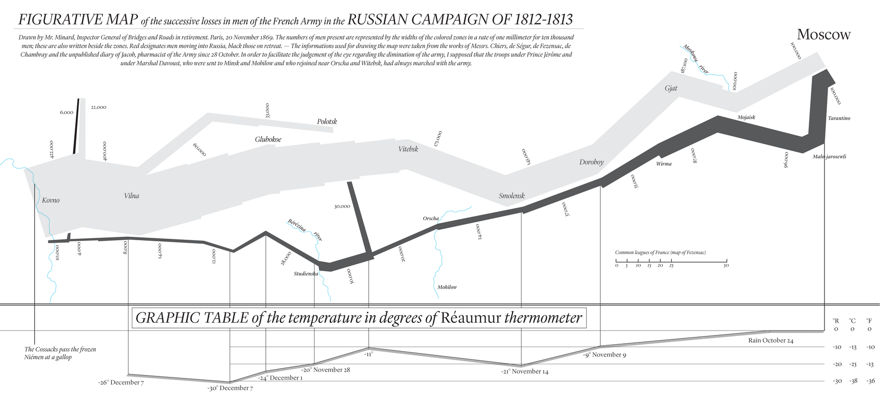
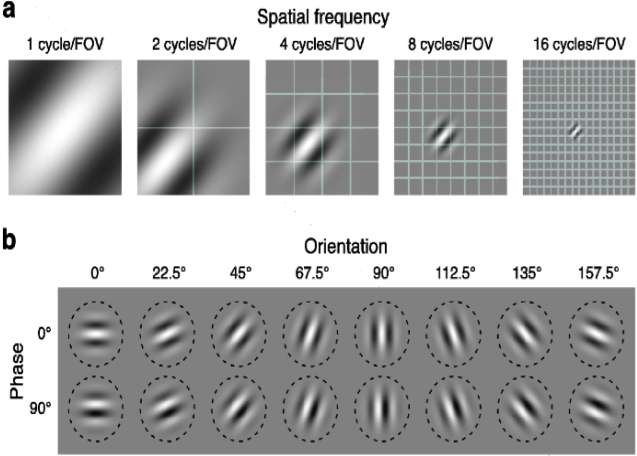
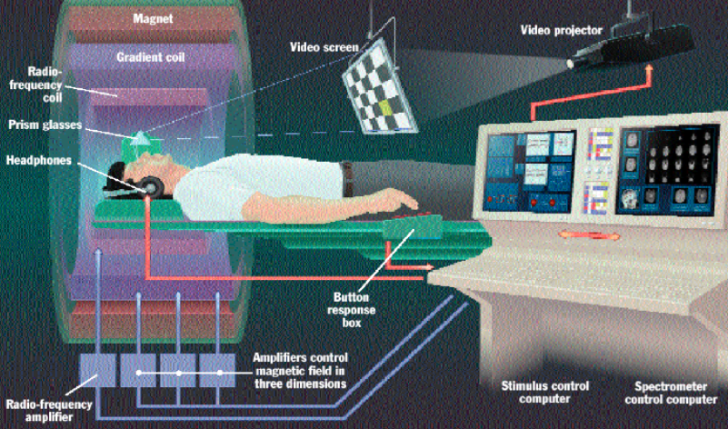

# Exploratory data analysis

The term "exploratory data analysis" was brought into populat use by John W. Tukey via his <a href="http://www.amazon.com/Exploratory-Data-Analysis-John-Tukey/dp/0201076160">book of the same name</a>, although we would be misguided if we claimed that no-one plotted their data before Tukey came along. Visual data exploration dates back thousands of years give a *brief* summary of the history. Humans are very visual, a large part of our brain is based on processing and interpreting what we see and we are extremely good at making judgements based on visual prompts. 

So what should we be visualizing?

* raw data

* summaries of your data

* transformations of your data

* results of your models or algorithms

Essentially at every step of your analysis, you can do some visualization. Visualization is a great way to identify the range of your data, as well as any problems with your data: perhaps there are missing values coded as a particular integer (perhaps as "0" or "999"), or strange values (perhaps someone mistyped a number). It is always a good idea to mix visualization with modelling (don't simply visualize your data and then proceed to modelling and assume that the visualization stage is over!). 

In *A tour through the visualization zoo* by Jeffrey Heer, Michael Bostock and Vadim Ogievetsky (2010), the authors quote that

> "Well-designed visual representations can replace cognitive calculations with simple perceptual inferences and improve comprehension, memory, and decision making. By making data more accessible and appealing, visual representations may also help engage more diverse audiences in exploration and analysis. The challenge is to create effective and engaging visualizations that are appropriate to the data."

Quotes by William Cleveland:

> “Visualization is critical to data analysis. It provides a front line of attack, revealing intricate structure in data that cannot be absorbed in any other way. We discover unimagined effects, and we challenge imagined ones.”

> “There are two components to visualizing the structure of statistical data – graphing and fitting. Graphs are needed, of course, because visualization implies a process in which information is encoded on visual displays. Fitting mathematical functions to data is needed too. Just graphing raw data, without fitting them and without graphing the fits and residuals, often leaves important aspects of data undiscovered.”

Expand on these and make more connections!

In summary:
**Visualization should be your first choice for your analysis when writing papers, giving presentations _and for life_.**

## A good graph is worth a thousand words: examples of visual data

### Giuseppe Piazzi, Gauss and the discovery of Ceres

In 1801, Giuseppe Piazzi, an Italian Catholic priest, mathematician and astronomer, observed three sightings of a new "planet", and he recorded its positions in the sky and the time at which he saw it. The image below from <a href="http://www.schillerinstitute.org/fid_97-01/982_orbit_ceres.pdf">Tennenbaum and Director, 1997</a> shows the three positions of Ceres observed by Piazzi. This is an example of visualization of data. It's not just boxplots and histograms (although they are informative too), we also want to simply *look* at what we are analyzing. What he observed was that this particular planet was moving slowly counter-clockwise against the "sphere of the fixed stars". This would have been very difficult to convey in text or numerical form, this visual preresentation is the most informative way of representing this data. We are given context such as the location of other stars relative to the new planet. 

Piazzi was in fact making a lot of assumptions based on his observations. He assumed that the planets observed at the three different locations were the same, but why? There are a lot of alternative theories he could have come up with.

In fact it was Carl Friedrich Gauss, a German mathematician and physical scentist who made significant contributions to many fields (including number thoery, algebra, statistics, analysis, differential geometry, geophysics, electrostatistics, astronomy and optics) who actually showed, using Piazzi's three data points, that the three planets observed by Piazzi were one in the same; Ceres. He sed Kepler's second law of planetary motion to describe the trajectory of Ceres.

In fact, Gauss was using *Least Squares* (put in link) to describe Ceres' trajectory. Isn't it amazing that these Gauss and Piazzi were able to get so much information from only *three data points*. They certainly didn't need "big data"! It's not really about how much data you have, but rather it's about how much information each observation contains.

### Napoleon's invasion of Russia

You could write entire books to even summarize the events in Napoleon's invasion of Russia, but to obtain a concise, yet complete, summary, visualization offers far superior tools as Charles Minard's map (below) shows. Here, Minard is able to simultaneously plot in two dimensions six different types of data. The plot contains substantial amounts of information about the progression of Napoleon's army. There is geographic information (the distance travelled, the longitude and latitude), the direction of travel, the number of troops in Napoleon's army, the temperature and the location relative to specific dates.

However, not all graphics are created equal. Below we show another example of a plot designed to show the same information. Although Minard's plot above removes some of the detailed geographical information, it actually portrays the the viewer the information in a more concise but substantially more interpretable and understandable way. The map below is too noisy and cluttered that it becomes confusing and it is difficult to extract the useful information.

### Neuroscience: Hubel and Wiesel's cat experiment

Hubel and Wiesel (1959) conducted some of the pioneering research in showing how the visual system constructs complex representations of visual information from simple stimulus features. In one of their most notable experiments, they anesthetized a cat and propped its eyes open, so that the cat was physically seeing things, but was not conscious. They inserted a microelectrode into the primary visual cortes of the cat and they projected bright patterns (circle, line) on a dark screen in front of the cat. What they found was that some neurons fired rapidly when presented with lines at one angle, while others responded best to another angle. 

This can be inerpreted as a causal inference problem: placing the bright object in the line of view of the cat *caused* the neurons to fire. This influential work was described by Professor David Ottoson of the Karolinsks Institue as

> "The signal message that the eye sends to the brain can be regarded as a secret code to which only the brain possesses the key and can interpret the message. Hubel and Wiesel have succeeded in breaking the code"

There has been a recent new wave of research interest in the area of understanding how the brain processes visual stimuli, particularly utilizing deep learning algorithms. A modern direction that developed from Hubel-Wiesel's work in the way in which we computationally preprocess images for analysis. We use *Gabor filters* to model simple cells in the visual cortex, so Gabor functions can be thought of as the mathematical representation of the perception in the human visual system.

Gabor filters (see image below) correspond to functions which represent the particular spatial frequencies, locations and orientations that were discovered by Hubel and Wiesel's cat experiment in 1959. When analysing images, it is very common to decompose the image into the gabor functions for analysis.

### Movie reconstruction using fMRI data: The Gallant Lab

This is a project that I was involved in with Jack Gallant's lab from the Redwood Center for Theoretical Neuroscience at UC Berkeley. The Gallant lab performed a number of functional magnetic resonance imaging (fMRI) exeriments, which measure oxygenated bloodflow in the brain. Measuring oxygenated blood flow can be considered as an indirect measurement of neural activity (the two processes are highly correlated). 

fMRI takes measurements for each voxel (the brain is segmented into voxels which are $1 \times 1 \times 1$mm cubes used to segment a brain into voxels in an analagous way to which we can segment an image into pixels), each of which contains hundreds of thousands of neurons. Compare this modern aproach to Hubel and Wiesel's cat experiment which was measuring a single neuron firing, we can see that fMRI gives fairly imprecise measurements. However, given that we have billions of neurons, measuring a single neuron tells us little about how the entire brain functions.

Again, the data is visual: from each fMRI experiment, we obtain cross sectional images of the brain and the blood flow in each voxel. We placed three different subjects in an fMRI machine and showed them videos while measuring their brain activity as shown in the image below.

For example, below displays an image viewed by a subject in the fMRI machine and a reconstruction of their brain activity at that moment. The blue regions of the brain shows regions of low activity in the brain and the red regions correspond to high activity (is this right?).

Amazingly, we were able to use fMRI data to reconstruct short segments of film trailers shown to the subjects as the video below shows. There were 7200 seconds of training videos and 5400 seconds of test videos. Some people call this "mind-reading" although really it's just data visualization and prediction. 

give more details of how we did this. It wasn't clear to me from the lecture...

<iframe width="560" height="315" src="https://www.youtube.com/embed/nsjDnYxJ0bo" frameborder="0" allowfullscreen></iframe>

### Predicting brain activity in the visual cortex: The Gallant Lab

Another project related to that of the fMRI movie reconstruction is the prediction of the brain's responses to visual images as measured in 20 voxels. Recall that fMRI records measurements for discretized 3D volumes of the brain (cube-like regions called voxels), much like an image can be spatially discretized into units of pixels.

For this experiment, the subject is shown pictures of everyday objects, such as a baby, or a house etc. Each picture is a $128 \times 128$ pixel gray scale image, which can be represented by a vector of length $128^2 = 16384$. These image vectors can be reducted to length $10921$ though a transformation based on Gabor wavelets.

Although the actual fMRI response to a given stimulus/image is a function of time, the response of each voxel to each image has been reduced to a single number. The question we are interested in answering using this data is "do these features/predictors drive the brain signals?". Once again, we seek a causal relationship.

Given that we have for each voxel response, $10921$ possible predictors from each image, we used the Lasso(put link!) estimate together with [cross-validation](#cv) to identify the most important predictors. That is, for each of the 20 voxels, we are fitting a separate linear model where most of the variable coefficients have been shrunk to zero.

For example, in the image above, the blue spots in the left-most correspond to the transformed pixels which are most important for predicting the response for voxel A, and similalry for the responses for Voxels B and C in the two subsequent images.

We could simply accept the variables that the lasso did not shrink, but wouldn't it make sense to actually look at the models being selected over each cross-validation fold?

The figure above shows two version of the same histogram describing the number of features selected by each model. It is clear that most of the models select approximately 50 features (by shrinking all other coefficients to 0). The histogram provides us with an overview (by combining all voxels into the same plot) of the models that we have fitted to this data. What have we assumed by visualizing all voxels simultaneously? Primarily, we are assuming that the voxels are comparable to one another, an assumption that seems reasonable. However, it would probably be a good idea to look at the voxels individually as well, since with this combined approach, we might be masking some interesting information corresponding to individual voxels. 

## Tools for visualizing data

There are a wide array of tools availble in multiple programming languages for visualizing data. The examples we present are based on the R programming language. 

There are a number of considerations that one should take into any plotting adventure. Here we list a few: Fix up!

* Continuous values are better mapped into continuous gradient scales, whereas discrete colours should be used to represent different categories.

* Bright colours draw attention better than dull colours. For example, if you wish to have the viewers attention drawn to a particular point, colour it in a bright color!

* Transparancy and point size (for example in scatterplots) should be utilized for large datasets so that more information can be portrayed without overplotting becomming an issue.

* A smoothing line provides information about the overall trend prsnt in scatterplots or time series plots, especially when there are many data points overplotted ontop of one another.

* Brushing can be used to effectively bring in other variables.

* Motion (such as movies) an bring out structures that static representations cannot.

If you're using R, you should really be using the data visualization package ggplot2 designed by Hadley Wickam rather than the base R plotting tools. Many of the above considerations can be irritatingly difficult to achieve in most plotting languages but are incredibly easy and natural (not to mention aesthetically pleasing!) with ggplot2. 

Often the most effective visualization tools are the simple ones.

### Scatterplots and smoothing

Scatterplots are likely to be one of the first types of exploratory data anlysis that you were exposed to. Traditional scatterplots involve plotting one variable against another, however as data is becomming more and more complex, many extensions to this traditional, yet useful, plot have begun to take hold. For example, making use of transparancy and colour is an extremely useful way to demonstrate concentrations of points as well as categorical information and may even add another continuous variable into the plot.

- still extremely useful, but try to use transparency

### Histograms

* Shows you how much data you have

### Kernel estimation

What if, instead of looking at histograms, we estimated the density and plotted that instead:

The above example corresponds to Gaussian kernel density estimation for 10 data points (the red points plotted along the x-axis). For each data point, a Gaussian curve is plotted centered at the data point (these are the black curves). The spread of the curves is defined by the *bandwidth* (see blow). The Gaussian kernel density estimate (the red curve) is then obtained by adding the height of the black curves.

Although in the example above, we have used Gaussian curves, there is no need to make this restriction. To define the general kernel density estimator, we first define a 1-dimensional kernel function, $K(\cdot)$, which satisfies
$$\int K(t) dt = 1 ~~~~~~~ \int t K(t) dt = 0$$

That is, we can think of the kernel function as a density that integrates to 1 and that corresponds to distribution has expected value 0. For the Gaussian example above, this would be the Gaussian density function.

We next define the rescaled kernel function with bandwidth $h$ (the bandwidth describes the spread of each individual curve) to be
$$K\_h(t) = \frac{1}{h} K\left( \frac{t}{h} \right)$$

so that a kernel density function of data (where we can notationally define the data by $x\_1, x\_2, ..., x\_n$) is defined to be 
$$g\_{n, h}(x) = \frac{1}{n} \sum\_{i=1}^n K\_h(x\_i - x)$$

From the formula above, we can see that the height of the kernel density estimator curve at a given $x$ is influenced by the height of each inidividual kernel curve at our data point $x\_i$ for $i = 1, ..., n$ (note that $x$ is our parameter, which we vary to trace out the kernel density curve, while the $x_i$ are the individual data points). In particular, assuming that the individual kernel functions, $K\_h$, are centered at $x\_i$, then the closer our location, $x$, is to a given point $x\_i$, the more height the kernel function for $x\_i$ will contribute.

The tuning parameter is the bandwidth, $h$. A small $h$ corresponds to very condensed spread (as if you're squeezing the kernel function), and a large $h$ corresponds to an elongated spread. 

It is easy to implement kernel smoothing estimators in R, and the only hard part stems from choosing the value bandwidth, $h$. There is currently no overall method for automatically selecting the bandwidth, and in general it is recommended that you try several and use your judgement to choose which one is the best fit for the data. For example, in the image above, the bandwidth of 1 is far too small, it is capturing all of the noise in the data. 

Note that we often call the bandwidth, $h$, a regularization parameter (we will see this again when discussing lasso and ridge linear models). Regularization parameters typically represent a tradeoff between bias and variance in our estimation. For example, from the image above, we see that the kernel density estimators with small bandwidth have very high variance (the curve jumps around a lot), but low bias (on average, the value of the kernel is close to the true value of the density). On the other hand, the kernel density estimators with large bandwidth have very low bias (the curve is very smooth and much less noisy) but have high bias (on average, the value of the kernel estimator might be quite far from the true value of the density). 

#### The bias-variance tradeoff

By using kernel density estimation we are in essence assuming that our data are realizations of a sequence of random variables, $X\_1, X\_2, ..., X\_n$. It is important to question whether this even makes sense for the data at hand. If the answer is yes, begin to pry information such as what is the sampling model? Where does the randomness come from?

Let's change the notation for our kernel density estimation by assuming that our observations are in fact realizations of random variables, $X\_1, X\_2, ..., X\_n$, with a density function, $f$. Then kernel density estimation is trying to estimate $f$ using

$$\hat{f}\_{n, h}(x) = \frac{1}{n} \sum_{i=1}^n K\_{h}(X\_i - x)$$

Is $\hat{f}\_{n,h}(x)$ a random variable? Yes is is, because it is a function of the random variables $X\_i$. Is $\hat{f}\_{n, h}(x)$ a good estimator for $f$? Firstly, the answer to that question depends on what we mean by "good": do we mean an estimator with low bias, an estimator with low variance, or perhaps a combination of the two?

We mentioned above that short bandwidths correspond to an estimator, $\hat{f}\_{n, h}(x)$, of $f$ that has low bias, but high variance, whereas long bandwidths corresponds to an estimator that has high bias but low variance. Is one of these two extremes better than the other? Is it possible to obtain a happy midground between the two? This is where the bias/variance trade-off comes in: perhaps we would rather find an estimator that minimizes a combination of the bias and the variance, such as the mean squared error (MSE):

$$\text{MSE} = \text{Bias}^2 + \text{Variance}$$

In fact, in modern statistics, gains are often obtained by increasing bias, but reducing variance. We can add a regularization (or smoothing) parameter to control the trade-off between bias and variance (we will return to this concept when we discuss the lasso linear model).

In particular, the mean squared error for the kernel estimator can be approximated by

$$
\begin{aligned}
\text{MSE} &= \text{Bias}^2 + \text{Variance} \\\
& \approx \left[ \frac{1}{4} \sigma^4\_K \left(f^{\prime \prime}(x)\right)^2\right] h^4 + \frac{1}{nh} \left[ \int K(u)^2 f(x) du \right]
\end{aligned}
$$

which shows that the bias increases with the bandwidth, $h$, while the variance decreases with $h$.

The mathematical steps are presented in the appendix at the end of this section for curious readers, but could easily be skipped without much loss of understanding.

### Q-Q plots

* fancier than histograms

## ggplot2 in R

## Appendix: the bias-variance tradeoff for kernel estimation

#### The bias of $\hat{f}$:

The expected value of $\hat{f}\_{n, h}(x) = \frac{1}{n} \sum\_{i=1}^n K\_h(X\_i - x)$ is given by

$$
\begin{aligned}
E(\hat{f}(x)) &= E\left( \frac{1}{n} \sum\_{i=1}^n K\_h(X\_i - x) \right)\\\ 
              &= \frac{1}{n} \sum\_{i=1}^n E(K\_h(X\_i - x)) \\\
              &= E(K\_h(X\_1 - x))
\end{aligned}
$$

where we have used both the linearity of expectation in the second equality and the fact that the $X\_i$ are IID in the third equality.

Continuing, we get that

$$
\begin{aligned}
E(\hat{f}(x))  & = E(K\_h(X\_1 - x))  \\\
                     & = E\left( \frac{1}{h} K\left(\frac{X\_1 - x}{h}\right) \right) \\\
                     & = \int \frac{1}{h} K\left( \frac{z - x}{h} \right) f(z) dz \\\
\end{aligned}
$$

Using the change of variables $u = (z - x)/h$, we get that

$$
\begin{aligned}
E(\hat{f}(x)) & = \int K\left( u \right) f(x + hu) du \\\ 
\end{aligned}
$$

which implies that the expected value of $\hat{f}$ is an average of $f$ locally around $x$, howver this integral is not analytically solvable so we use a Taylor expansion of $f(x + hu)$ in the argument $hu$, which is valid as $h \rightarrow 0$:

$$f(x + hu) = f(x) + f^{\prime}(x) hu + \frac12 f^{\prime\prime}(x) h^2 u^2 + \text{smaller order terms} $$

Thus substituting this into our equation for $E(\hat{f}(x))$, we end up with

$$
\begin{aligned}
E(\hat{f}(x)) & \approx \int K\left( u \right) \left[ f(x) + f^\prime(x) h u + \frac12 f^{\prime \prime}(x) h^2 u^2 \right] du \\\ 
& \approx f(x) + \frac{f^{\prime \prime}(x)}{2} h^2 \int K(u) u^2 du 
\end{aligned}
$$

since $\int K(u) du = 1$ and $\int u K(u) du = 0$, by definition. Thus the bias of $\hat{f}$ is given by

$$\text{Bias} = E(\hat{f}(x)) - f(x) = \frac{f^{\prime \prime}(x)}{2} h^2 \int K(u) u^2 du  + \text{smaller order terms}$$

#### The variance of $\hat{f}$:

Similar calcualtions show that the variance of $\hat{f}$ is

$$
\begin{aligned}
\text{Var}(\hat{f}(x)) &= \text{Var}\left( \frac{1}{n} \sum\_{i=1}^n \frac{1}{h} K \left( \frac{X\_i - x}{h} \right) \right)\\\
& = \frac{1}{n^2h^2} \sum\_{i=1}^n \text{Var}\left( K \left( \frac{X_i - x}{h} \right) \right)
\end{aligned}
$$

where we can take the sum out of the variance expression because the $X\_i$ are IID. Continuing, we have

$$
\begin{aligned}
\text{Var}(\hat{f}(x)) &=  \frac{1}{n}  \text{Var}\left( \frac{1}{h} K \left( \frac{X_1 - x}{h} \right) \right) \\\
& = \frac{1}{n}  E \left( \frac {1}{h}K \left( \frac{X\_1 - x}{h} \right) \right)^2  \\\
&= \frac{1}{h} \int K\left( \frac{z - x}{h} \right)^2 f(z) dz\\\
& = \int K(u)^2 f(x + hu) du\\\
& = \int K(u)^2 \left[ f(x) + f^\prime(x) h u + \frac12 f^{\prime \prime}(x) h^2 u^2 \right] du\\\
& \approx \int K(u)^2 f(x) du 
\end{aligned}
$$

Thus the variance can be approximated by

$$
\begin{aligned}
\text{Var}(\hat{f}(x)) &\approx \frac{1}{nh} \left[ \int K(u)^2 f(x) du \right] 
\end{aligned}
$$

#### Mean squared error calculation

Finally, putting the above calculations together, we obtain an expression for the mean squared error:

$$
\begin{aligned}
\text{MSE} &= \text{Bias}^2 + \text{Variance} \\\
& \approx \left[ \frac{1}{4} \sigma^4\_K \left(f^{\prime \prime}(x)\right)^2\right] h^4 + \frac{1}{nh} \left[ \int K(u)^2 f(x) du \right] 
\end{aligned}
$$

where $\sigma^2\_K = \int u^2K(u) du$.

Here we see that the bias term is large when $h$ is large and the variance term is small when $h$ is large.

## Notes

A number of excellent resources for data visualization exist. Some of the traditional, yet still relevant, texts include *The future of data analysis* by Tukey (1962), *Envisioning information* by Edward R. Tufte (1990) and *Visualizing data* by William S. Cleveland (1993). Some more modern references include *A tour through the visualization zoo* by Jeffrey Heer, Michael Bostock and Vadim Ogievetsky (2010). For those interested in learning more about graphics in R, you need look no further than the works by Hadley Wickham, including his book *ggplot2: Elegant Graphics for Data Analysis (Use R!)* (2009) and that of his collaborators including the *R Graphics Cookbook* by Winston Chang (2013).

For references on kernel density estimation, see M. Rosenblatt (1956)'s *Remarks on some nonparametric estimates of a density function* , and E. Parzen (1962)'s *On estiamtion of a probabilty density function and mode*.

