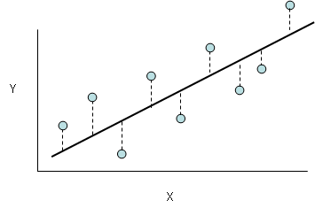
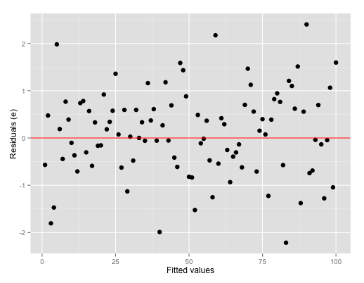
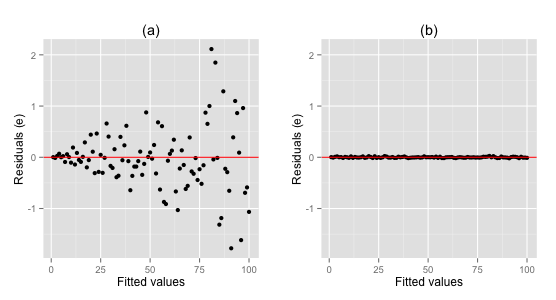
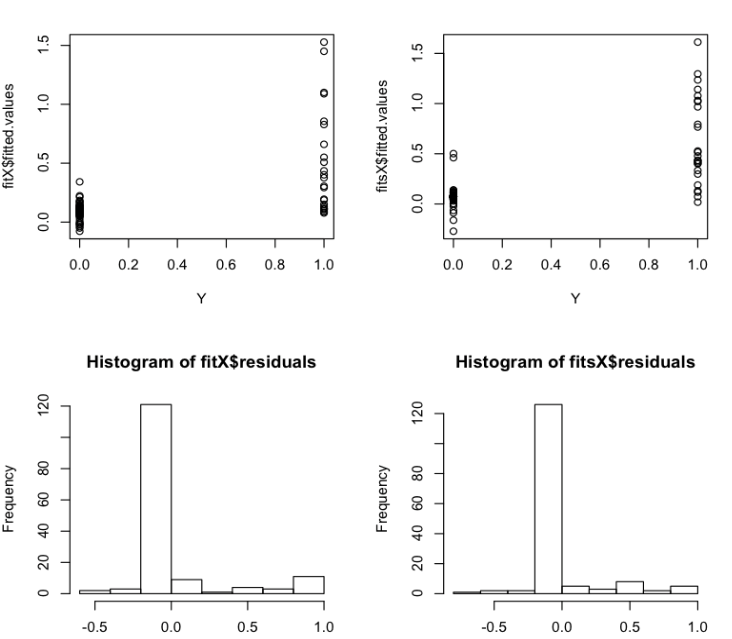

# Linear models

Suppose that we were interested in predicting height using measurements of weight as a predictor. A simple way to do this might be to come up with an equation of the form
$$\text{height} = a + b \times \text{weight}$$
for some constants $a$ and $b$. You might be revolted at such a gross oversimplification of the relationship between height and weight: surely we all *know* that measurements height and weight don't fall on a perfectly straight line; there are all sorts of deviations! If you took the time to take a random sample of people, measure their heights and weights, and then plotted the height measurements against the weight measurements, you'll notice that there certainly are deviations from the straight line, but that the overall trend is linear. Thus, perhaps our model above will be more accurate if we add a term that can represent these deviations:

$$\text{height} = a + b \times \text{weight} + \epsilon$$

where $\epsilon$ is some random number that, on average is zero, but varies randomly about zero. A representation such as this is what we call a simple linear model: linear models can be used to describe a continuous response variable in terms of a linear combination of one or more predictor variables plus some noise. 

We can start to get fancy by adding other variables such as gender and age, and even perhaps some interaction terms, but we might be getting ahead of ourselves. There is an important question to ask first. What are the values of $a$ and $b$? The answer is, unfortunately, that we can never know. If this model is to be believed, these values exist for an overall population which is most likely so large that we can never measure the height and weight of every individual in the population. We can, however, observe a sample from this population, and we can use these sample individuals to *estimate* the values of $a$ and $b$.

To motivate some notation, suppose that we want to fit a linear model to a response $y$ and we have $p$ predictor variables, $x\_1, x\_2,..., x\_p$ then we can write this linear model as

$$y\_i = \beta\_0 + \beta\_1x\_{1,i} + \beta\_2 x\_{2,i} + ... + \beta\_px\_{p,i} + \epsilon\_i$$

where the subscript $i$ specifies that we are talking about the model for individual $i$ from our sample. Notice that every individual has the same values of $\beta\_1$, ..., $\beta\_p$ (since these don't depend on $i$), but different values for $y\_i, x\_{1, i}, x\_{2, i}, ..., x\_{p, i}, \epsilon\_i$. To frame this in the setting of the example above, each individual has different weights, ages, genders, etc but the same linear relationship exists between height and these predictor variables for each individual. 

Suppose that we have a sample of $n$ individuals from a population. We can write the above model in **matrix form** as follows

$$Y = X \beta + \epsilon$$

where 

$$Y =\left[ \begin{array}{c}y\_1\\\ y\_2 \\\   \vdots\\\   y\_n\end{array} \right]$$ 

is a $n \times 1$ **response vector** for our $n$ individuals, 

$$X =\left[ \begin{array}{ccccc}
1 & x\_{1, 1} & x\_{1, 2} & \dots & x\_{1, p}\\\
1 & x\_{2, 1} & x\_{2, 2} & \dots & x\_{2, p}\\\
\vdots &  \vdots & \vdots & \ddots & \vdots \\\
 1 & x\_{n, 1} & x\_{n, 2} & \dots & x\_{n, p} \end{array}\right]$$

is a $n \times (p + 1)$ **design matrix** for our $n$ observations (the first column corresponds to the intercept term and the remaining columns correspond to the $p$ variable measurements for each individual),

$$\beta = \left[ \begin{array}{c}\beta\_0 \\\ \beta\_1\\\ \beta\_2 \\\   \vdots\\\   \beta\_p\end{array} \right]$$ 

is our $(p \times 1) \times 1$ **coefficient vector**, and

$$\epsilon = \left[ \begin{array}{c}\epsilon\_1\\\ \epsilon\_2 \\\   \vdots\\\   \epsilon\_n\end{array} \right]$$

is our random $n \times 1$ **error vector**, whose entries specify the deviations of each individuals response from the specified linear form. We typically assume that $E(\epsilon | X) = 0$ and $Var(\epsilon | X) = \sigma^2 I$, but we do not necessarily *need* normality. As a result of these assumptions, we have that the expected response is given by

$$E(Y | X) = E(X \beta + \epsilon | X) = E(X \beta| X) + E(\epsilon | X) = X \beta$$

The model, $Y = X \beta + \epsilon$ is commonly referred to as a *linear regression* model. However, recall that both $\beta$ and $\epsilon$ are unknown! If we knew $\beta$, we could make predictions of the form $\hat{Y} = X\beta$. Thus, to make a linear regression model useful, we need to *estimate* the parameters, $\beta$. To recap, the primary assumptions underlying the linear regression model (beside from the obvious assumption of linearity) are

* The errors $\epsilon\_i$ are independent and identically distributed (iid) with mean 0 and variance $\sigma^2$.

* If the $X$ are random, we assume that $\epsilon$ is independent of $X$.

Note that nowhere have we explicitly assumed a Gaussian distribution for the errors!

--------

### Fitting a linear model using OLS

How do we come up with an estimator $\hat{\beta}$ of the population coefficients $\beta$? In general, we want to find the value of $\hat{\beta}$ such that the predicted $Y$ values, $\hat{Y} = X \hat{\beta}$ are as close to the true values, $Y$, as possible. If we use the $L^2$ measure of "closeness", then we want to find the value of $\beta$ that minimizes the quadratic loss function:

$$\hat{\beta} = \underset{\beta}{\text{arg}~\text{min}} \\| Y - X \beta\\|\_2^2 =  \underset{\beta}{\text{arg}~\text{min}} \sum\_{i = 1}^n (y_i - X\_i \beta)^2$$

where $X\_i = [1 ~ x\_{i,1}~ x\_{i, 2} ~... ~x\_{i, p}]$ is the $i$th row of the design matrix (the predictor vector for observation $i$). In the image below, this corresponds to finding the line such that the vertical distances between the observations and the line are minimized.

If our design matrix, $X$, is full rank, then the value of $\beta$ that minimizes the above expression can be written as 
$$\hat{\beta}\_{OLS} = \left(X^TX\right)^{-1}X^T Y $$

and this is what we call the **ordinary least squares** (OLS) estimator (because it is the minimizer of the *squared loss* function). Note that if $X$ is not full rank, it is possible to calculate a generalized inverse using singular value decomposition, however in this case, the solution (the minimizer) is not unique, as we will explore below. 

------

### The hat matrix: generating predictions

In summary if we use OLS to estimate, $\beta$, the equation that we get (and thus the predictions from the linear model that we obtain) can be given by

$$\hat{Y} = X\hat{\beta}_{OLS} = X\left(X^TX\right)^{-1}X^TY = HY$$

where $H$ is called the **hat matrix** (a cute name that arose due to the fact that $H$ puts a "hat" on Y). To be more technical, the hat matrix, $H$, is a projection matrix onto the linear space spanned by the columns of $X$. Note that $X$ is a matrix, so try your hardest to resist the temptation to cancel the $X$'s in the above expression (we cannot rearrange matrices like we can scalars: $ X\left(X^TX\right)^{-1}X^T \neq  \left(X^TX\right)^{-1}X^TX = I$).

A projection-based proof of the OLS formulation of $\hat{\beta}$ is as follows:

The idea is to use the hat matrix, $H = X(X^TX)^{-1}X^T$, to show that $HY$ is the projection of $Y$ onto the column space of $X$. To begin, it is straightforward to check that 

1. $H$ is idempotent: $HH = H$,

1. and thus that $(I - H)H = 0$, and

1. $X$ is invariant under $H$: $HXb = Xb$ for any $b \in \mathbb{R}^n$. 

To show that $H$ is the projection matrix onto the column space of $X$, we can thus proceed as follows:

\begin{aligned}
\\|Y - X\beta\\|\_2^2 & = \\|Y - HY + HY - X\beta\\|\_2^2\\\
& = \\|Y - HY + H(Y - X\beta)\\|\_2^2 && \text{from (3)}\\\
& = \\|Y - HY \\|\_2^2 + \\|H(Y - X\beta)\\|\_2^2 + 2Y^T(I - H)H(Y-X\beta)\\\
& = \\|Y - HY \\|\_2^2 + \\|H(Y - X\beta)\\|\_2^2 && \text{from (2)}\\\
& \geq \\|Y - HY\\|\_2^2
\end{aligned}

This implies that the (L^2) distance from our response $Y$ to the "true" regression line, $X\beta$ is greater or equal to the distance from our response $Y$ to $HY$. Thus, since $HY = X(X^TX)^{-1}X^TY = X\hat{\beta}\_{OLS}$, it must follow that this fitted line is the best that we can do in terms of estimating the line $X\beta$ by minimizing the distance between the fitted line and our response $Y$.

-----------

### Sources of randomness 

Let's ask a question: is $\hat{\beta}$ random? What about $\beta$? To answer this question, let's ask, where does the randomness in the model come from? We usually consider $X$ to be fixed (but this is not a requirement), and $\beta$ is a *constant* (but unobservable) population variable. **The only source of randomness in the regression model $Y = X \beta + \epsilon$ is in the random error, $\epsilon$** ($Y$ is random only because it depends on $\epsilon$). Keep this in mind, because it is very important! So we ask again: is $\hat{\beta}$ random? Look again at the formula $\hat{\beta} = \left(X^TX\right)^{-1}X^T Y$. The $X$ matrices are fixed, but $Y$ is random (due to its dependency on $\epsilon$). Thus, the answer is: yes, $\hat{\beta}$ is random! In fact, if we were to draw another sample and re-estimate $\beta$ using the new $X^\*$ and $Y^\*$, then we would get a different value for our estimator $\hat{\beta}^\* = \left(X^{\*T}X^\*\right)^{-1}X^{\*T} Y^\*$ despite the fact that both $\hat{\beta}$ and $\hat{\beta}^\*$ estimates of $\beta$: they can both be considered as realizations of the same **random variable**, $\hat{\beta}$. 

-------

### Residuals

We can rearrange the above equation as

$$Y = X \hat{\beta}_{OLS} + e$$

where $e = Y - X \hat{\beta}_{OLS}$ are called the **residuals**. The $i$th residual, $e\_i$, measures how far the predicted response $\hat{y}\_i$ is from the true value, $y\_i$. However, it is a common misconception that the formula presented above is the regression model. This merely represents a relationship that is always true: that the observed values are equal to the predicted values plus the residuals (the difference between the observed and predicted values). There is no description in the above formula of the sources of randomness assumed by the model. The linear regression model is the formula containing the explicit random error variable $\epsilon$, $Y = X \beta + \epsilon$.

It is not hard to show that the vector of residuals, $e$, is orthogonal to $X$:

\begin{aligned}
X^Te &= X^T(y - X\hat{\beta}) \\\
& = X^T(y - X(X^TX)^{-1}X^Ty)\\\
& = X^Ty - X^TX(X^TX)^{-1}X^Ty\\\
& = X^Ty - X^Ty\\\
&= 0
\end{aligned}

moreover, this implies that the residuals always sum equal to zero *whenever the model has an intercept term*. This is because the if the model has an intercept term, then the first column of $X$ is simply a column of $1$'s, and the orthogonality of $X$ and $e$ implies that

$$\sum\_{i=1}^n e\_i = 0$$

(if you're not sure where this came from, expand the matrix multiplication $X^Te$, and it should be clear).

Next, given that we have a **fitted linear model**, $\hat{Y} = X \hat{\beta}$, how can we figure out how well the model is fitting the data? It makes sense to look at how close the fitted/predicted values are to the true values: that is, it makes sense to look at the residuals. In fact, a common measure of adequacy of model fit is given by the residual sum of squares (RSS):

$$RSS = \sum\_{i=1}^n (y\_i - \hat{y}\_i)^2 = \sum\_{i=1}^n e\_i^2$$

However, looking at the $RSS$, we only get an overall view of how cose the responses predicted by the model are to the true responses. Looking at the $RSS$ (or an $R^2$ value) and claiming that the model fits well is the equivalent of claiming to understand a dataset because we have looked at some summary statistics such as the mean of each variable. Clearly there is a lot more that we could consider! One such way is to assess the distirbution of the residuals, usually though a plot of the residuals $e\_i = y\_i - x\_i^T \hat{\beta}$ versus the fitted values $\hat{y}\_i = x\_i^T\hat{\beta}$ (although we could alternatively plot the residuals versus some other value such as time or a variable in the data).  In general, we hope to observe that the residuals are randomly scattered about the line $e = 0$, such as in the figure below.

On the other hand, patterns in the plot that do not follow this random scattering pattern are typically indicative of regions in the data where the model doesn't work well, or over-fits. For example, panel (a) in the figure below displays an example in which the variance of the residuals is much larger for large values of the fitted values. Such a residual plot can be used to identify heteroskedasticity (i.e. that our assumption of equal variance for all of our error terms was incorrect). In this case, we might decide that our original model was incorrect, and we are better off estimating $\beta$ using [generalized least squares](http://rlbarter.github.io/Stat_Models_Book/16-gls.html). The residuals in panel (b), however, exhibit extremely small variation, indicating that the model may be overfitting the data and thus is unlikely to work well on external datasets. One thing to keep in mind is the importance of the scale of the axis. In particular, if we zoomed in on the residual plot in panel (b), we would see an image resembling the randomly scattered residuals in the figure above. The interpretation of the plot depends on the scale used, so it is vital to use a scale appropriate to the data.

Residual plots can be used to identify places where the model doesn’t work well or over-fits. In particular, if the residuals appear to be randomly scattered about zero for a particular range of fitted values, but appear non-random for a different range of fitted values, we might conclude that the model is works well over the first range but not on the second.

--------

### Properties of the OLS estimator $\hat{\beta}$

Note that OLS was just one approach (in particular, minimizing the squared, or $L^2$, loss: $\sum\_{i=1}^n(Y\_i - X\_i \beta)^2$) to estimating the coefficient vector, $\beta$. There are a number of alternative approaches such as the least absolute difference (LAD) which minimizes the $L^1$-loss $\sum\_{i=1}^n|Y\_i - X\_i \beta|$ (we will discuss alternatives later). However, there are a number of properties that the OLS approach possesses that makes it particularly attractive as an estimator. Namely, the OLS estimator is unbiased and has an asymptotic Gaussian distribution. We will explore these properties below.

#### Unbiasedness

It is not hard to show that the OLS estimator, $\hat{\beta}\_{OLS}$, is *unbiased*. That is, on average, over random samples from our population, our estimate, $\hat{\beta}\_{OLS}$, will be equal to the "true" population value, $\beta$:

\begin{aligned}
E\left(\hat{\beta}\_{OLS} \Big| X\right) &= E\left( (X^TX)^{-1}X^TY \Big| X \right)\\\
& = (X^TX)^{-1}X^T E(Y | X)\\\
& = (X^TX)^{-1}X^T X\beta\\\
& = \beta
\end{aligned}

#### Variance

Recall that the only source of randomness in the linear model is the random error, $\epsilon$. In particular, we assumed that the $\epsilon\_i$ were iid with variance $\sigma^2$. This implies that the variance-covariance matrix of the vector $\epsilon = (\epsilon\_1, ..., \epsilon\_n)$ is given by
$$Cov(\epsilon | X) = \sigma^2 I \_{n \times n} = \left[ \begin{array}{cccc} \sigma^2 & 0 & \dots & 0\\\
0 & \sigma^2 & \dots & 0 \\\
\vdots & \vdots & \ddots & \vdots \\\
0 & 0 & \dots & \sigma^2 \end{array} \right]$$
The variance-covariance matrix of the OLS estimator, $\hat{\beta}\_{OLS}$, is given by:

\begin{aligned}
Cov\left( \hat{\beta}\_{OLS} \Big| X \right) & = Cov\left( (X^TX)^{-1}X^TY \Big| X \right)\\\
& = (X^TX)^{-1}X^T ~Cov(Y | X)~ X(X^TX)^{-1}\\\
& = (X^TX)^{-1}X^T ~Cov(X\beta + \epsilon | X)~ X(X^TX)^{-1}\\\
& = (X^TX)^{-1}X^T ~Cov(\epsilon | X)~ X(X^TX)^{-1}\\\
& = (X^TX)^{-1}X^T~\sigma^2 I\_{n \times n}~X(X^TX)^{-1}\\\
& = (X^TX)^{-1}\sigma^2
\end{aligned}

##### Example:
For a simple example, suppose that we have a simple linear model $y\_i = \beta\_0 + \beta x\_i + \epsilon\_i$, then 
$$X = [1 ~~~ x] = \left[ \begin{array}{cc} 1 & x\_1\\\ 1 & x\_2 \\\ \vdots & \vdots \\\ 1 & x\_n \end{array}\right]$$

which implies that 
$$(X^TX)^{-1} = \frac{1}{\sum\_{i=1}^n x\_i^2 - \left( \sum\_{i=1}^n x\_i\right)^2}\left[ \begin{array}{cc} \frac{1}{n} \sum\_{i=1}^n x\_i^2 & - \bar{x}\\\ - \bar{x} & 1 \end{array} \right]$$

so our estimate is given by

$$\hat{\beta} = (X^TX)^{-1}X^Ty = \left[\bar{y} - \frac{Cov(x, y)}{Var(x)} \bar{x}~,~~ \frac{Cov(x, y)}{Var(x)} \right].$$

From here, it is easy to calculate the variance of $\hat{\beta}\_0$ and $\hat{\beta}\_1$:
$$Var(\hat{\beta}\_0) = \sigma^2\frac{\frac{1}{n} \sum\_{i=1}^n x\_i^2}{\sum\_{i=1}^n x\_i^2 - \left( \sum\_{i=1}^n x\_i\right)^2},$$

and

$$Var(\hat{\beta}\_1) = \sigma^2\frac{1}{\sum\_{i=1}^n x\_i^2 - \left( \sum\_{i=1}^n x\_i\right)^2}.$$

#### Asymptotic normality

Since the OLS estimate of $\beta$ corresponds to the *maximum likelihood estimate*, theoretical results tell us that when we have a large sample size, the distribution of our estimator, $\hat{\beta}$ should be approximately Gaussian. What should the mean and variance of this distribution be? We found the mean and variance of $\hat{\beta}$ above, so our distributional result is

$$\hat{\beta}\_{OLS} \overset{n \rightarrow \infty}{\sim} N\left( \beta, \sigma^2 (X^TX)^{-1} \right)$$

In fact this asymptotic result follows from the **central limit theorem** (CLT) which tells us that if we have a sequence of iid random variables, $X\_1, ..., X\_n$, drawn from *any distribution*, and if $E(X\_i) = \mu$ and $Var(X\_i) = \sigma^2 < \infty$ for each $i$, then the distribution of the sample average, $\bar{X} = \frac{1}{n}\sum\_{i=1}^n X\_i$, tends to a normal distribution. More specifically, the result tells us that 

$$ \bar{X} \overset{d}{\rightarrow} N\left(\mu, \frac{\sigma^2}{n}\right)$$

which is quite remarkable, given that our sample of $X\_i$'s could have come from any distribution at all (we just need the samples to be iid)! Most existing proofs of this fact are fairly tedious and fail to lead to an improved sense of intuition. An outline of the more interesting and intuitive proofs are discussed in [an enlightening blog post](https://terrytao.wordpress.com/2010/01/05/254a-notes-2-the-central-limit-theorem/) by Terence Tao.

#### Estimating $\sigma^2$

Note that the variance of $\hat{\beta}_{OLS} = \sigma^2 (X^TX)^{-1}$ depends on $\sigma^2$, the common variance of $\epsilon\_i$. If we want to get an idea of how variable our estimate, $\hat{\beta}\_{OLS}$ is, then it is important that we have some idea of what $\sigma^2$ is equal to. Unfortunately, we rarely do! Thus we need to estimate $\sigma^2$ somehow. As a first approach, perhaps we could estimate $\sigma^2$ by looking, not at the variance of $\epsilon\_i$ (since these are unobserved), but rather at the variance of the residuals, $e\_i$, which can be thought of as realizations of the error terms $\epsilon\_i$ (in fact, they would be realizations of $\epsilon$ if the proposed linear model was the "truth"). Recall that

\begin{aligned}
e &= Y - HY = (I - H)Y\\\
& = (I- H)(X\beta + \epsilon)\\\
& = (I - H) \epsilon
\end{aligned}

Then perhaps, since $\sigma^2 = Var(\epsilon\_i) = E(\epsilon\_i^2) \approx \frac{\sum\_{i=1}^n e\_i^2}{n}$, a reasonable estimate might be

$$\hat{\sigma}^2 = \frac{\\|e\\|\_2^2}{n} = \frac{\sum\_{i=1}^n e\_i^2}{n}$$

This estimator, though not far from what we are searching for, turns out to be biased:

\begin{aligned}
E\left[ ||e||^2 \Big| X \right] & = E \left[ ||(I - H) \epsilon||^2 \Big | X\right]\\\
& = E\left[ \epsilon^T (I - H) \epsilon \Big| X\right] && (I - H)^2 = I - H \text{ and } ||a||^2 = a^Ta\\\
& = E \left[ tr(\epsilon^T(I - H) \epsilon )\Big| X \right] && tr(a) = a \text{ for }a \in \mathbb{R} \\\
& = E\left[ tr((I - H) \epsilon \epsilon^T) \Big| X \right] && tr(AB) = tr(BA)\\\
& = tr\left( E\left[(I - H) \epsilon \epsilon^T \Big| X \right]\right)\\\
& = tr\left((I - H) E\left[\epsilon \epsilon^T \Big| X \right]\right)\\\
& = tr\left((I - H) Cov( \epsilon) \right)\\\
& = \sigma^2 tr(I - H)\\\
& = \sigma^2 (n  -p) &&\text{(trace of a proj. matrix is its rank)}
\end{aligned}

Thus an unbiased estimate of $\sigma^2$ is given by

$$\hat{\sigma}^2 = \frac{\sum\_{i=1}^ne\_i^2}{n-p}$$

--------

### Interpreting the linear model

Suppose that we have a linear model

$$y = \beta\_1 x\_1 + \beta\_2 x\_2$$

and that we have estimated $\hat{\beta}\_1 = 2$ and $\hat{\beta}\_2 = 2.1$. How would we identify which predictor, $x\_1$ or $x\_2$, is "important" or "suggestive" of the response $y$? A naive answer is to claim that $x\_2$ has more predictive power than $x\_1$ simply because it has a larger coefficient. Unfortunately, although this is the most common interpretation of the coefficients of a linear model, it is often incorrect. It is important to normalize the coefficients by the standard error of the estimator i.e. don't simply use the *size* of $\hat{\beta}$ alone to reflect the "importance" of a predictor. We should instead be examining the standardized values:
$$\frac{\hat{\beta}\_j}{\hat{\text{SE}}{\hat{\beta}\_j}}$$

To understand why, recall that these coefficient estimates, $\hat{\beta}\_1 = 2$ and $\hat{\beta}\_2 = 2.1$ are simply realizations of *random variables*, and these values do not capture the variability of these estimates of $\beta\_1$ and $\beta\_2$ at all. Thus although $\hat{\beta}\_1$ and $\hat{\beta}\_2$ are themselves not directly comparable, the standardized versions are.

Suppose now that we again have $\hat{\beta}\_1 = 2$, and $\hat{\beta}\_2 = 2.2$, but that $\text{SE}(\hat{\beta}\_1) = 0.2$ and $\text{SE}(\hat{\beta}\_2) = 2.1$. Then 

$$\frac{\hat{\beta}\_1}{\hat{\text{SE}}{\hat{\beta}\_1}} = 10 \hspace{1cm} \text{and} \hspace{1cm} \frac{\hat{\beta}\_2}{\hat{\text{SE}}{\hat{\beta}\_2}} = 2$$

Thus, although the initial estimates were very similar, the standardized values provide very strong evidence that $\hat{\beta}\_1$ is significantly different from zero (and thus that $x\_1$ is informative), but we are somewhat less confident that $\hat{\beta}\_2$ is significantly different from zero (although we note that a standardized value $2$ is still reasonably far from zero, it is much less significant than $10$). In the case of this example, we would consider $x\_1$ to be more informative.

Now we consider the case where $x\_1$ and $x\_2$ are highly correlated, with $\text{cor}(x\_1,x\_2) = 0.99$, say. In this instance, it is hard to say which predictor is more important than the other, and the coefficients of each in the linear model become less interpretable: it would make little sense to discuss the effect of a unit change of one variable while holding the other constant. Further the estimators themselves become unstable, with the OLS estimator of the coefficients of correlated variables having much higher standard error. In fact it might be a better idea to simply use one of $x\_1$ and $x\_2$ (rather than both) or to combine them into a super predictor $\tilde{x} = x\_1 + x\_2$ (assuming $Var(X\_1) = Var(X\_2) = 1$) and estimate its coefficient. In this case we would have
$$ y = \alpha \tilde{x} + \epsilon$$
and we want to estimate $\alpha$.

The main point to take away from the above discussion is that it is never a good idea to simply look at each variable isolation. We instead need to consider the whole picture, in particular, the way in which the variables interact with one another.

-------

### Using OLS for categorical data

As a side note, although it is uncommon to use OLS to generate a linear model for two-class (binary) problems (a more modern approach is to use logistic regression, which we will discuss later), it remains a perfectly reasonable thing to do. If we had three-class or other multi-class problems, however, OLS is no longer reasonable, primarily because the labeling of these categorical classes as the numbers $1, 2, 3, 4, ...$ implies that class $1$ is more similar to class $2$ than it is to class $4$ (simply because the numbers $1$ and $2$ are closer together than the numbers $1$ and $4$), which is, in most cases, monstrously incorrect! Thus, typically when we consider linear regression, we are assuming that our response variable, $Y$, is *continuous*.

-------

### Leverage

It is an unfortunate fact that OLS estimates of $\beta$ are extremely sensitive to outliers in the data. How does one measure the "outlierness" of a given data point? One common approach (outside of the imprecise art of eyeballing) is to use a quantity called **leverage**, an extremely useful concept from regression diagnostics and robust statistics. It turns out that for observation $i$, the $i$th diagonal element of the hat matrix, $H$, is its **leverage score**, $h\_i$. That is,
$$h\_i = H\_{ii}$$

Interestingly, **leverage doesn't measure "outlierness" in terms of the response, $Y$, it only measures extreme values in terms of our predictor space**. To see this, recall that $H =  X\left(X^TX\right)^{-1}X^T$.

------

### Least squares when $X$ is not full rank

To obtain the estimate $\hat{\beta} = \left(X^TX\right)^{-1}X^T Y$, we needed to be able to invert the matrix $X^TX$. When $X$ is not full-rank (as is the case when we have more predictor variables than observations; a very common phenomenon in the modern world), this is not possible. Fortunately, however, it is still possible to generate a solution to the least squares problem (i.e. to obtain an estimate of $\beta$), although such a solution is no longer unique.  

In the non-full-rank case, to obtain an estimate of $\beta$, instead of attempting to calculate the uncalculatable inverse of $X^TX$, we instead calculate the pseudo-inverse of $X^TX$ using Singular Value Decomposition (SVD). 

Let's begin with a useful definition:

* A square matrix, $U$, is **unitary** if and only if $U^{-1} = U^T$.

SVD tells us that we can decompose a matrix, $X$ into the following form

$$X = U S V^T$$

where

* $U$ is a unitary $n \times n$ left-eigenvector matrix whose columns correspond to the eigenvectors of $XX^T$, 

* $S$ is a diagonal $n \times p$ matrix whose non-zero eigenvalues are the square-root of the eigenvalues of $XX^T$ or $X^TX$, and 

* $V$ is a unitary $p \times p$ right-eigenvector matrix whose columns correspond to the eigenvectors of $X^TX$.

The **pseudo-inverse** of $X$ is then given by

$$X^{-} = V \cdot 1/S \cdot U^T$$

where $1/S$ is the diagonal matrix whose diagonal entries are the reciprocal of the non-zero elements of $S$ (the zero-entries are set to zero).

In the case of OLS, we can use $\left(X^TX\right)^{-}$ in place of the traditional inverse $\left(X^TX\right)^{-1}$ to find a particular (but non-unique) solution to the LS problem. The resultant fitted value is the projection of $Y$ onto the space spanned by the columns of $X$ and it is unique.

<!---
### Example: Enron data

Recall the Enron data in which we have measurements of the number and recipients of emails sent between employees of the Enron coorporation. Recall that in our discussion of PCA, we were able to isolate legal employees from other types of employees. Perhaps we can come up with some features based on the email data that could predict whether or not a given employee was a lawyer or not. 

We note that in this example, we have a binary response that can be represented by $y\_i \in \\{0, 1\\}$, where $y\_i = 0$ if employee $i$ was not from the legal department and $y\_i = 1$ if employee $i$ was from the legal department Although these days it is uncommon to use LS to generate a model for two-class (binary) problems (a more modern approach is to use logistic regression, which we will discuss later), it remains a perfectly reasonable thing to do. If we had three-class or other multi-class problems, however, LS is no longer reasonable, primarily because the labelling of these categorical classes as the numbers $1, 2, 3, 4, ...$ implies that class $1$ is more similar to class $2$ than it is to class $4$ (simply because the numbers $1$ and $2$ are closer together than the numbers $1$ and $4$), which is, in most cases, monstrously incorrect!

Suppose that we only want to use 10 of the 154 predictor variables to train the model. How do we choose these 10 individuals? Random selection? These randomly selected 

-->

--------

## Regression towards the mean (the regression fallacy)

Consider students in a class where the assessment includes a midterm in the middle of the semester and a final exam at the end of the semester. If we look at the students who do really well in the midterm and then examine their final exam grade. With a very high probability, although these students will still do very well in the final exam, they will do worse in the final exam than in the midterm. Similarly, if we look at the students who did not do well in the midterm, then there is a very high chance that they will do better in the final exam than they did in the final exam.

We can propose many plausible mechanisms for why this may happen: for example, the students who did very well in the midterm felt that they could relax and didn't study as hard for the final exam as they otherwise might have if they were disappointing with their grade. Similarly, the students who performed poorly in the midterm were worried about their grade and studied very hard for the final exam with the end result that they did better on the final exam than they did on the midterm.

For example, we tend to experience "football shaped" scatterplots, such as that presented above. We see that all of the points are clustered around the mean (the blue regression line), but the observations which are extreme in both axes tend to be closer to the regression line.

It is important not to confuse a difference in the test scores with regression to the mean.

